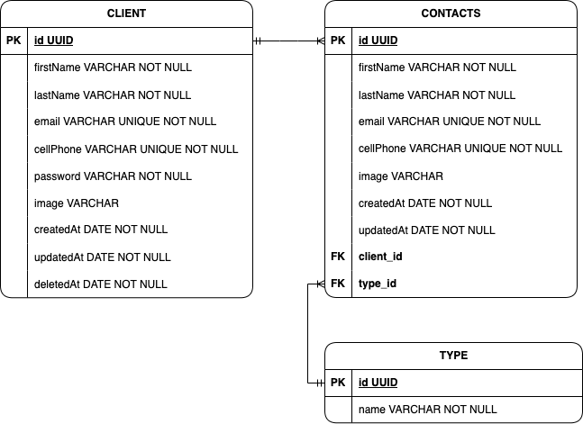

# CONTACTLAND

O <strong>CONTACTLAND</strong> tem como objetivo ser uma ferramenta que reúne todos os seus contatos, trazendo facilidade para encontrar e-mails e telefones de empresas ou pessoas de qualquer convivio social. <br><br>
Projeto desenvolvido em Março/23.<br><br>

## <strong>Back-end:</strong>
<br>

### Instalação e execução da aplicação e testes:<br>

1. Acessar o diretório *back-end* e:
<br><br>

#### Instalação de dependências com bash:
```bash
yarn install
```
<br>

### Defina as variáveis de ambiente no arquivo .env e:<br>

1. Acessar o diretório *contacts_book* e:
<br><br>

#### Execute testes da aplicação com bash:
```bash
yarn test
```

### Rode as migrações:<br>
```bash
yarn typeorm migration:run -d src/data-souce.ts
```

#### Execute a aplicação com bash:<br>
```bash
yarn dev
```
<br>

### Diagrama ER: 
<br><br>

### Documentação API:
https://client-contact-fullstack.vercel.app/ <br><br>

### Deploy API:
**em breve** <br><br>

### Insomnia:
<a href="https://insomnia.rest/run?label=Contact_Book&uri=https%3A%2F%2Fclient-contact-fullstack.vercel.app.%2F%2Finsomnia.json" target="_blank"></a><br><br>

### Tecnologias/libs utilizadas:
 1. Node.js;
 2. Express;
 3. TypeScript;
 4. TypeORM;
 5. PostgreSQL;
 6. Jest;
 7. SQLite;
 8. Supertest;
 9. Jsonwebtoken;
 10. Bcryptjs;
 11. Zod.
<br><br><br>

## <strong>Front-end:</strong>
<br>

### Instalação e execução da aplicação: <br>

1. Acessar o diretório *contacts_book* e:
<br><br>

#### Instalação de dependências com bash:
```bash
yarn install
```

#### Execute a aplicação com bash:<br>
```bash
yarn dev
```
<br>

### Deploy:
**em breve** <br><br>

### Tecnologias/libs utilizadas:
 1. React.js;
 2. TypeScript;
 3. Axios;
 4. React-hook-form;
 5. React-hot-toast;
 6. React-icons;
 7. React-router-dom;
 8. Zod;
 9. Styled Components;
<br><br>
